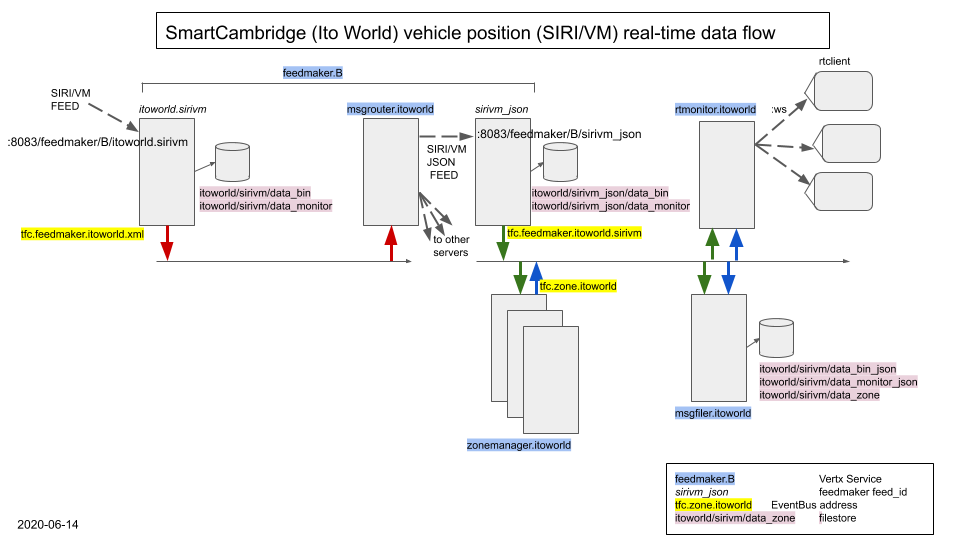

# Siri/VM feed support



The boxes in the diagram represent Vertx `verticles`, and the structure is designed to:
1. propagate the data in real-time, i.e. support *stream processing* of the SiriVM messages.
2. Allow any server in the cluster (we currently have five) to receive the 'posted' XML SiriVM data and forward that data to the
others servers, but with all servers having the same configuration.

The verticles are generally designed to do one job well, e.g. store the data, calculate journey times through pre-defined zones, or send the data on to a remote consumer which might be a web page or another server.

## SiriVM feed handler `feedmaker.B` `itoworld.sirivm`

This ingests the incoming XML feed from the supplier, arriving as a series of regular HTTP POSTs.

We use an instance of the `FeedMaker` verticle, configured as a Vertx service defined in `feedmaker.B.json`, including a feed
handler within it `itoworld.sirivm`. (On our platform, one FeedMaker vertical can run multiple instances of an actual feed handler).

For each arriving POST, `feedmaker.B`:
1. Saves the incoming data in a unique timestamped file with a directory path including `data_bin/YYYY/MM/DD`, i.e. a unique
directory for each day, with the files sortable by timestamp.

2. Places a copy of the incoming data in a `data_monitor` directory, overwriting the previous file. This is a convenience to
provide easy access to the latest received message. Noobs tend to poll this directory rather than find out how to subscribe asynchronously to the data which is what our platform is designed for.

3. Parses the SIRIVM XML, creates a flattened JsonObject containing the data, and sends that as a message on the Vertx
EventBus, using address `tfc.feedmaker.itoworld.xml`. The *only* verticle that subscribes directly to data from this address is
`msgrouter.itoworld`.

## MsgRouter `msgrouter.itoworld`

This verticle *subscribes* to the data coming from the `itoworld.sirivm` feed handler, and POSTs it onwards to all five servers, including the same server that is hosting the original feedhandler. It would be simple to use a more local connection for the local server (rather than the http POST) but that hasn't been necessary so far.

Note that `msgrouter.itoworld` is forwarding the pre-digested JSON versions of the incoming SiriVM messages.

## SiriVM JSON feed handler `feedmaker.B` `sirivm_json`

This is a second feed handler launched by the same Vertx service `feedmaker.B`, and its purpose is to ingest the JSON messages
appearing from `msgrouter.itoworld`.

Note this equally applies to the other four servers that are *not* running the top-level `itoworld.sirivm` feed handler, i.e. we 
use the MsgRouter to ensure the data goes to all five servers, and process it downstream of the MsgRouter, regardless of whether
the local server is ingesting the original feed or not, in fact the downstream processing is now independent of whether the
physical server was the original recipient of the XML feed.

## Serving real-time data on websockets: `rtmonitor.itoworld`

This is an instance of the RTMonitor verticle, which *subscribes* to the real-time vehicle position data, maintains 
some local state based on the data that's been seen, and responds to subscription requests (using a simple but 
proprietary exchange of JSON messages on the websocket) to http clients. The canonical example of this flow is 
the 'moving bus map', where the client actually requests a subscription to vehicle position messages within a 
lat/lng box and the RTMonitor filters the incoming messages are requested.

`rtmonitor.itoworld` also subscribes to real-time feeds (aka *data streams*) from other verticles in the system 
(such as the zone transit analysis) and makes that available to the same websocket clients.

## Storing the data: `msgfiler.itoworld`

This is a common verticle on our platform which performs the simple task of subscribing to messages (in this example those
coming from the `sirivm_json` feed handler and also the `zone` verticles below) and copies them to persistent storage.
We have written various permutations of `MsgFiler` over the years (for example, to store the messages in NoSQL 
stores and time-series databases) but for our purposes we are able to use the filesystem (i.e. store the data in 
flat files) fairly effectively.

## Stream processing zone analysis `zonemanager.itoworld`

A 'zone' is a simple lat/lng polygon that we might want to monitor in real-time.

`ZoneManager` is actually more of a `meta-verticle` in that it's entire purpose is to spawn many copies of the `Zone` 
verticle (~100) which asynchronously subscribe to the streaming position data and continually update their state for 
their particular zone. The most general-purpose use has been to generate 'zone transit times' for polygons defined 
in the region from which we gain considerable insight into the state of the traffic (and definitively, bus journey 
times). We have used found interest in different types of real-time geospatial processing, from monitoring individual 
segments of road, to journeys from outside a city to the center.

Processing within a 'Zone' verticle (like all Vertx verticles) is 'real-time', i.e. the data arrives asynchronously, 
the state is updated on every data tick, and a 'zone-transit' event is transmitted *immediately* the event is recognized. 
This is the essence of how all data moves in the system, resulting the minimum latency as events occur.


## Subscribing to the real-time SiriVM feed

```
<Siri version="1.3" xmlns="http://www.siri.org.uk/siri" xmlns:xsi="http://www.w3.org/2001/XMLSchema-instance" xsi:schemaLocation="http://www.siri.org.uk/ http://www.siri.org.uk/schema/1.3/siri.xsd">
<SubscriptionRequest>
    <RequestTimestamp>2020-06-12T13:06:00Z</RequestTimestamp>
    <RequestorRef>[[THE REQUESTOR REF]]</RequestorRef>
    <ConsumerAddress>[[THE CONSUMER HTTP ADDRESS THE DATA WILL BE POSTED TO]]</ConsumerAddress>
    <SubscriptionContext>
          <HeartbeatInterval>PT1M</HeartbeatInterval>
    </SubscriptionContext>
    <VehicleMonitoringSubscriptionRequest>
        <SubscriptionIdentifier>[[SOME INCREMENTING NUMBER</SubscriptionIdentifier>
        <InitialTerminationTime>2024-12-08T14:10:00Z</InitialTerminationTime>
        <VehicleMonitoringRequest version="1.3">
            <RequestTimestamp>2020-06-12T13:06:00Z</RequestTimestamp>
            <VehicleMonitoringRef>[[THE VEHICLE REF]]</VehicleMonitoringRef>
        </VehicleMonitoringRequest>
    </VehicleMonitoringSubscriptionRequest>
</SubscriptionRequest>
</Siri>
```

For a successful 'subscribe', the server will respond with:
```
<Siri version="1.3" xmlns="http://www.siri.org.uk/siri" xmlns:xsi="http://www.w3.org/2001/XMLSchema-instance" xsi:schemaLocation="http://www.siri.org.uk/siri http://www.siri.org.uk/schema/2.0/xsd/siri.xsd">
  <SubscriptionResponse>
    <ResponseTimestamp>2020-05-21T17:00:06+01:00</ResponseTimestamp>
    <ResponderRef>[[RESPONDER NAME]]</ResponderRef>
    <ResponseStatus>
      <ResponseTimestamp>2020-05-21T17:00:06+01:00</ResponseTimestamp>
      <SubscriberRef>[[THE REQUESTOR REF ABOVE]]</SubscriberRef>
      <SubscriptionRef>4</SubscriptionRef>
      <Status>true</Status>
    </ResponseStatus>
  </SubscriptionResponse>
</Siri>
```
